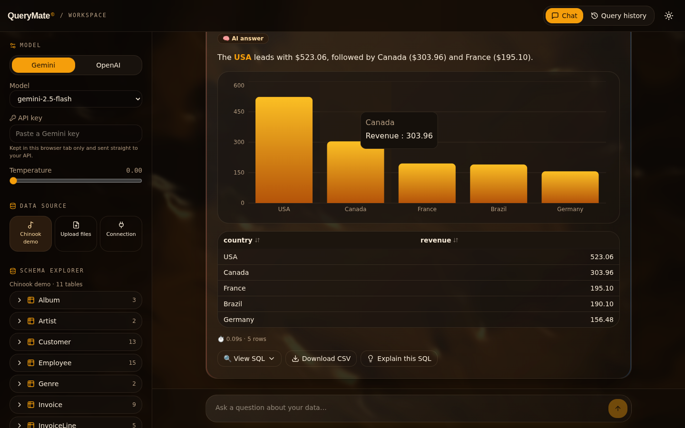
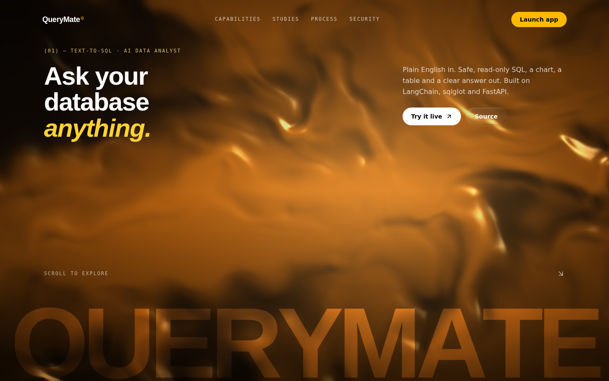
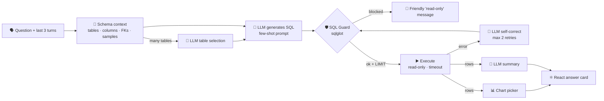

# 🔥 QueryMate

**Ask your database questions in plain English — no SQL needed.**

**🔴 Live demo: [querymate-kzi3.vercel.app](https://querymate-kzi3.vercel.app)**

[](https://www.python.org/)
[](https://fastapi.tiangolo.com/)
[](https://react.dev/)
[](https://python.langchain.com/)
[](https://www.sqlalchemy.org/)
[](https://motion.dev/)
[](LICENSE)


**[▶ Live demo](https://your-querymate.vercel.app)** · **[API docs](https://your-querymate-api.onrender.com/docs)**



QueryMate lets a non-technical business user type a question like *"Which 5 countries generated the most revenue?"* and get back:

1. **Safe, read-only SQL** generated by an LLM (Gemini or OpenAI)
2. The **result table**
3. An **auto-generated chart**
4. A **plain-English summary** with the key numbers

It is a **FastAPI** backend (LangChain LCEL pipeline, sqlglot guard, SQLAlchemy) and a **React + Vite + Tailwind + Framer Motion** frontend. The design is an agency-style, WebGL-driven look inspired by the 21st.dev *Zen* template, recoloured with the warm **Amber Hearth** palette.



---

## ✨ Features

- 💬 **Chat interface** with follow-up questions ("now only for Germany"): the last 3 questions and their SQL are sent as context
- 🧠 **Gemini (free tier) or OpenAI**, switchable in the settings panel, with model and temperature controls
- 🎵 **Zero-setup demo** on the Chinook music-store database (downloaded automatically on first run)
- 📄 **Upload CSV / Excel** (drag and drop): every file and every Excel sheet becomes a table with clean `snake_case` columns
- 🔌 **PostgreSQL / MySQL** via a connection string (under *Advanced*), opened read-only
- 🧭 **Schema explorer**: tables → columns, types, keys and 3 sample rows
- 🛡️ **SQL guard** with `sqlglot`: single `SELECT` / `WITH … SELECT` only, dangerous keywords blocked, `LIMIT 500` injected
- 🔧 **Self-correction**: if the database rejects a query, the error is sent back to the LLM to fix it (max 2 retries), shown as *Auto-fixed query*
- 📊 **Rule-based charts** (no LLM): line for time series, sorted top-15 bar for categories, scatter for two numbers, big metric for single values
- 🔍 **View SQL** (syntax highlighted, copyable), **💡 Explain this SQL**, **⬇️ Download CSV**, sortable paginated tables, execution time and row count
- 📜 **Query history** tab (question, SQL, ✅/❌, rows, time) with CSV export
- 🙂 **Friendly errors** for bad or missing API keys, blocked SQL, empty results and unreadable uploads
- 🎨 **Amber Hearth** palette on a near-black, glass-panel workspace with a live ambient shader, dark/light toggle and mobile drawer layout
- 🌀 **Landing page**: a procedural WebGL "molten metal" shader hero that reacts to the pointer and scroll, a giant blended wordmark, layered section transitions, a capability list with cursor-following previews, a liquid-glass carousel of real query studies (drag, arrows or keyboard), a pinned horizontal process section and a clip-path reveal finale

## 🏗️ How it works



```
Browser (React + Framer Motion)  ──HTTP/JSON──▶  FastAPI (api/)  ──▶  QueryPipeline (src/)  ──▶  SQLite / Postgres / MySQL
                                                                     └──▶  Gemini / OpenAI (LangChain LCEL)
```

Every pipeline step in `src/pipeline.py` is its own LCEL runnable (`prompt | llm | StrOutputParser() | parser`), so each can be tested in isolation with a fake model.

## 🔐 Security

QueryMate is designed so that a prompt can never change your data:

| Layer | What it does |
|---|---|
| **Read-only connection** | SQLite is opened with `file:…?mode=ro`; PostgreSQL / MySQL sessions are set to `READ ONLY` |
| **sqlglot validation** | The SQL is parsed into an AST; exactly one statement is allowed and its root must be `SELECT` (or `WITH … SELECT` / `UNION`) |
| **Blocked keywords** | `INSERT, UPDATE, DELETE, DROP, ALTER, CREATE, TRUNCATE, ATTACH, DETACH, PRAGMA, MERGE, GRANT, REVOKE, VACUUM …` are rejected (string literals are ignored, so `WHERE note = 'drop'` still works) |
| **No "fixing" of blocked SQL** | Queries rejected for safety are never sent back to the LLM |
| **Row limit** | `LIMIT 500` is added when the query has none (`MAX_ROWS`) |
| **Timeout** | Queries are interrupted after `QUERY_TIMEOUT_SECONDS` |
| **Per-browser isolation** | Uploads, connections and history are keyed to a random session id and expire after `SESSION_TTL_MINUTES` |
| **No secrets in code** | Keys come from the server's `.env` / platform secrets, or from the user's browser tab (sent per request in `X-API-Key`, never stored server-side) |

> For production databases, always connect with a database user that only has `SELECT` privileges.

## 🧰 Tech stack

| Layer | Choice |
|---|---|
| Language | Python 3.11 · TypeScript |
| API | FastAPI + Uvicorn |
| LLM | Google Gemini (default, free tier) · OpenAI |
| LLM framework | LangChain LCEL (`langchain-core`, `langchain-google-genai`, `langchain-openai`) |
| Database | SQLAlchemy 2.x · SQLite (Chinook) · PostgreSQL / MySQL |
| SQL safety | sqlglot |
| Data | pandas |
| Config | pydantic-settings + `.env` |
| Frontend | React 19 · Vite · Tailwind CSS v4 · Framer Motion · raw WebGL (GLSL shader) · Recharts · React Router |
| Theme | Amber Hearth (shadcn / 21st.dev token names in `frontend/src/index.css`) |
| Tests | pytest (fake LLM, no network) |
| Packaging | `requirements.txt` · multi-stage Dockerfile · Render / Railway / Vercel configs |

## 🚀 Quick start

You need **Python 3.11** and **Node.js 20+**. Run the API and the frontend in two terminals.

**macOS / Linux**

```bash
git clone https://github.com/your-username/querymate.git
cd querymate

# Terminal 1: API
python3.11 -m venv .venv
source .venv/bin/activate
pip install -r requirements.txt
cp .env.example .env              # paste your GOOGLE_API_KEY (or OPENAI_API_KEY)
uvicorn api.main:app --reload     # http://localhost:8000/docs

# Terminal 2: frontend
cd frontend
npm install
npm run dev                       # http://localhost:5173 → click "Launch the app"
```

**Windows (PowerShell)**

```powershell
git clone https://github.com/your-username/querymate.git
cd querymate

# Terminal 1: API
py -3.11 -m venv .venv
.venv\Scripts\Activate.ps1
pip install -r requirements.txt
copy .env.example .env            # paste your GOOGLE_API_KEY (or OPENAI_API_KEY)
uvicorn api.main:app --reload

# Terminal 2: frontend
cd frontend
npm install
npm run dev
```

The Vite dev server proxies `/api` to `localhost:8000`. The Chinook database downloads into `data/` on first start (or run `python scripts/download_chinook.py`). Get a free Gemini key at [Google AI Studio](https://aistudio.google.com/app/apikey); you can also paste a key straight into the app's settings panel instead of using `.env`.

## 🐳 Docker

One container serves both the API and the built frontend:

```bash
docker build -t querymate .
docker run --rm -p 8000:8000 --env-file .env querymate
# open http://localhost:8000
```

## ☁️ Deploy (free tiers)

**Option A: one service (simplest).** Deploy the Dockerfile to **Render** (`render.yaml` Blueprint included) or **Railway** (`railway.json` included). Set `GOOGLE_API_KEY` (and/or `OPENAI_API_KEY`) as a secret. The app is then live at the service URL.

**Option B: API on Render / Railway + frontend on Vercel.**

1. Deploy the API as in option A and note its URL, e.g. `https://querymate-api.onrender.com`.
2. On **Vercel**: *Add New Project* → import the repo → set **Root Directory** to `frontend` (framework: Vite; `frontend/vercel.json` adds the SPA rewrites).
3. In Vercel, add the env var `VITE_API_URL=https://querymate-api.onrender.com` and deploy.
4. Back on the API, set `CORS_ORIGINS=https://your-querymate.vercel.app` and redeploy.

> Render's free tier sleeps after inactivity, so the first request can take ~30–60 s.

## ⚙️ Configuration

Backend settings come from `.env` or environment variables:

| Variable | Default | Description |
|---|---|---|
| `LLM_PROVIDER` | `gemini` | Default provider: `gemini` or `openai` |
| `GOOGLE_API_KEY` | – | Gemini API key (optional if users paste their own) |
| `OPENAI_API_KEY` | – | OpenAI API key |
| `GEMINI_MODEL` | `gemini-2.5-flash` | Default Gemini model |
| `OPENAI_MODEL` | `gpt-4o-mini` | Default OpenAI model |
| `LLM_TEMPERATURE` | `0` | Default temperature |
| `MAX_ROWS` | `500` | `LIMIT` added when a query has none |
| `QUERY_TIMEOUT_SECONDS` | `15` | Query time limit |
| `MAX_FIX_RETRIES` | `2` | Self-correction attempts after a database error |
| `TABLE_SELECTION_THRESHOLD` | `8` | Above this many tables, the LLM first picks the relevant ones |
| `SAMPLE_ROWS` | `3` | Sample rows per table (prompt + schema explorer) |
| `SUMMARY_ROWS` | `20` | Rows sent to the LLM for the summary |
| `HISTORY_TURNS` | `3` | Previous Q&A pairs sent for follow-ups |
| `CORS_ORIGINS` | `http://localhost:5173,…` | Allowed browser origins (your Vercel URL) |
| `MAX_UPLOAD_MB` | `50` | Upload size limit per file |
| `SESSION_TTL_MINUTES` | `120` | Idle time before a session's uploads and history are dropped |

Frontend (`frontend/.env`): `VITE_API_URL` (empty = same origin / dev proxy) and `VITE_GITHUB_URL`.

## 🔌 API

Interactive docs at `/docs`. Main endpoints:

| Method | Path | Purpose |
|---|---|---|
| `GET` | `/api/config` | Providers, models, example questions |
| `GET` | `/api/sources/{id}` | Schema of a data source (`chinook` or an upload / connection id) |
| `POST` | `/api/sources/upload` | Upload CSV / Excel files (multipart) |
| `POST` | `/api/sources/connect` | Connect by SQLAlchemy URL |
| `POST` | `/api/query` | Question → SQL, rows, chart spec, summary |
| `POST` | `/api/explain` | Explain SQL line by line |
| `GET` | `/api/history` · `/api/history.csv` | Query history (JSON / CSV) |

## 🧪 Running tests

```bash
pytest
```

57 tests run with an in-memory SQLite fixture, LangChain's `FakeListChatModel` and FastAPI's `TestClient`, so they need **no internet and no API key**. They cover the SQL guard, CSV/Excel loading, schema extraction, read-only enforcement, chart selection, the pipeline (valid SQL, self-correction, blocked `DROP TABLE`, empty results, table selection), history and every API endpoint.

## 💡 Example questions that work well (Chinook)

- Which 5 countries generated the most revenue?
- Show the monthly revenue trend for 2013 → then *"now only for USA"*
- What are the top-selling genres by tracks sold?
- Who is the best sales support agent by revenue?
- Which 10 artists have the most tracks in the catalog?
- What is the average invoice total per customer country?
- How many customers does each employee support?
- *"Delete all customers"* → blocked with a friendly message 🛡️

## 🗂️ Project structure

```
querymate/
├── api/
│   ├── main.py                # FastAPI routes (+ serves the built frontend)
│   ├── schemas.py             # request / response models
│   └── state.py               # per-session sources and history
├── src/
│   ├── config.py              # pydantic-settings
│   ├── llm.py                 # Gemini / OpenAI factory
│   ├── database.py            # engines (read-only), CSV/Excel → SQLite, schema, execution
│   ├── prompts.py             # all prompts + few-shot examples
│   ├── sql_guard.py           # sqlglot validation + LIMIT injection
│   ├── pipeline.py            # table selection → generate → validate → execute → self-correct → summarize
│   ├── charts.py              # rule-based chart picker → JSON chart spec
│   └── history.py             # query history + CSV export
├── frontend/                  # React + Vite + Tailwind + Framer Motion
│   └── src/
│       ├── pages/             # landing.tsx (marketing page), workspace.tsx (the app)
│       ├── components/zen/    # WebGL shader, hero, capabilities, glass carousel, finale
│       ├── components/app/    # sidebar, schema explorer, result card, chart, table, SQL block, history
│       ├── components/ui/     # motion helpers (text reveal, marquee, counters)
│       └── components/sections/   # pinned process, security
├── scripts/download_chinook.py
├── tests/                     # pytest suite (no API calls)
├── Dockerfile · render.yaml · railway.json · frontend/vercel.json
└── requirements.txt · .env.example · LICENSE
```

## 🧭 Limitations & future improvements

- **Semantic layer**: business definitions ("active customer", "net revenue") so the LLM uses agreed metrics
- **Query caching** for repeated questions
- **User authentication** and saved queries (sessions are anonymous and in-memory today)
- **BigQuery / Snowflake** connectors
- Streaming responses so the summary appears word by word
- The WebGL shader falls back to a static gradient where WebGL is unavailable and runs at a capped frame rate inside the app
- LLM output is probabilistic: always check the SQL for important decisions (that's why it's one click away)

## 👤 Author

**Agha Kazim Ali — Python Data Analyst & AI Developer**

[Upwork](https://www.upwork.com/freelancers/your-profile) · [LinkedIn](https://www.linkedin.com/in/your-profile) · [GitHub](https://github.com/your-username)

Licensed under the [MIT License](LICENSE).
